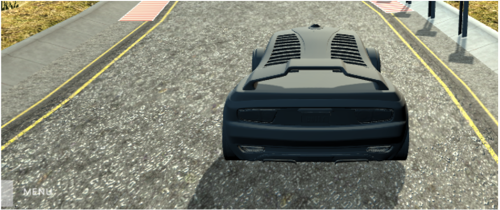
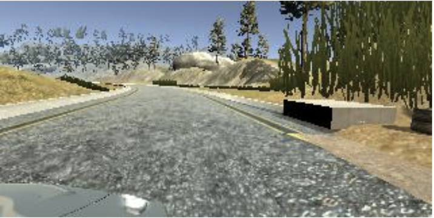

# **Behavioral Cloning**


### 
**Files Submitted & Code Quality**


#### 
**1. Submission includes all required files and can be used to run the simulator in autonomous mode**

My project includes the following files:


*   model.py containing the script to create and train the model
*   drive.py for driving the car in autonomous mode
*   model.h5 containing a trained convolution neural network
*   writeup_report.pdf summarizing the results
*   data_processing.py  for data augmentation

#### 
**2. Submission includes functional code**


Using the Udacity provided simulator and my drive.py file, the car can be driven autonomously around the track by executing


```
python drive.py model.h5
```


#### 
**3. Submission code is usable and readable**

The model.py file contains the code for training and saving the convolution neural network. The file shows the pipeline I used for training and validating the model, and it contains comments to explain how the code works.

Data_processing.py file contains the code for data augmentation. The file shows how I generate data samples for training.


### 
**Model Architecture and Training Strategy**


#### 
**1. An appropriate model architecture has been employed**

The architecture is based on Nvidia pipeline (model.py lines 37 - 57). Apart from the layers in Nvidia pipeline, I added an image cropping layer, a Keras normalization layer (code line 47) and 3 additional dropout layers for regularization. My pipeline is illustrated as follows:

Layer (type)                             Output Shape                          Param

=================================================================

cropping2d_1 (Cropping2D)    (None, 65, 320, 3)                   0         

_________________________________________________________________

batch_normalization_1            (Batch (None, 65, 320, 3)        12        

_________________________________________________________________

conv2d_1 (Conv2D)                (None, 31, 158, 24)                  1824      

_________________________________________________________________

conv2d_2 (Conv2D)                (None, 14, 77, 36)                    21636     

_________________________________________________________________

conv2d_3 (Conv2D)                (None, 5, 37, 48)                      43248     

_________________________________________________________________

conv2d_4 (Conv2D)                (None, 3, 35, 64)                      27712     

_________________________________________________________________

conv2d_5 (Conv2D)                (None, 1, 33, 64)                     36928     

_________________________________________________________________

flatten_1 (Flatten)                    (None, 2112)                            0         

_________________________________________________________________

dropout_1 (Dropout)               (None, 2112)                             0         

_________________________________________________________________

dense_1 (Dense)                    (None, 100)                              211300    

_________________________________________________________________

dropout_2 (Dropout)               (None, 100)                              0         

_________________________________________________________________

dense_2 (Dense)                    (None, 50)                               5050      

_________________________________________________________________

dropout_3 (Dropout)                (None, 50)                               0         

_________________________________________________________________

dense_3 (Dense with L2)        (None, 10)                               510       

_________________________________________________________________

dense_4 (Dense)                     (None, 1)                                11     


#### 
**2. Attempts to reduce overfitting in the model**

The final model contains dropout layers (model.py lines 50, 52, 54) and l2 regularizer (model.py line 55) in order to reduce overfitting. 

The model was trained and validated on different data sets to ensure that the model was not overfitting (model.py lines 105).

**2.1 initial architecture**

However, when I started with the initial architecture (Nvidia model), I didn't apply any overfitting techniques, as a consequence, the model overfits severely.


Figure 1 

As shown in Figure 1, both training and validation loss converges very quickly, they don't decrease significantly with number of epoch.

It turns out that initial model is not able to drive steadily on the lane: the car is not always in the middle of the lane, sometimes moves very close lane border, as shown in Figure 2.



Figure 2

**2.2 Adding dropout layers**

To combat overfitting, I added 3 dropout layers in between the fully-connected layers.

The model performs much better than the initial one. The car could pilot itself very well from the beginning, the first round corner and through the bridge. Before the second big round corner (the one right after bridge) , the car moves steadily and always keep in the center.

However, in the second big round corner, the car fails to make turn, which is beyond expectation for the reasons listed below:


*   in the training data, the car always makes very nice turn there.
*   in the first round corner (the one before the bridge), the car could well recognise the border, turn with right angle and stays in the middle of lane, which implies that the car is capable of making turns.


Figure 3

By comparing the two round corners, I figured out why the model didn't work out. The difference is that the second round corner has different border on the left side.

In a word, the model still overfits, it doesn't generalize to recognize different lane borders expect darker borders.

**2.3 Adding L2 regularizer**

In order to alleviate overfitting problem, I used a different technique from dropout, the L2 regularizer.

The combination of both dropout and L2 regularization relieve my model from severe overfitting, Figure 4 shows that both training and validation loss decreases significantly with number of epochs and they converge very close.


Figure 4

At the end of the process, the vehicle is able to drive autonomously around the track without leaving the road.


#### 
**3. Model parameter tuning**

The model used an adam optimizer, so the learning rate was not tuned manually 

The following parameters are tuned manually:

1.  The correction angle of left and right camera image for data augmentation
1.  The keep probability for dropout
1.  The L2 regularizer

#### 
**4. Appropriate training data**


Training data was chosen to keep the vehicle driving on the road. I used a combination of center lane driving, recovering from the left and right sides of the road.


*   The number of images is doubled, as all the original images are flipped from left to right to generate a mirror copy.
*   For left and right camera images, I applied angle correction to center angle. For those in which the car makes a shallow turn, the angle correction is set to 0.3. While for those in which the car makes a radical turn, the angle correction is increased to a slightly larger value 0.45.
*   Find the right number of laps of training data. Too many laps of data leads to  overfitting too, while too few laps results in underfitting.

**4.1 Creation of the Training Set**

To capture good driving behavior, I first recorded two laps on track one using center lane driving. Here is an example image of center lane driving:


Figure 5

I then recorded the vehicle recovering from the left side and right sides of the road back to center so that the vehicle would learn to turn itself away from lane border when it shifts from the the lane center. 



Figure 6


Figure 7

Then I flipped all the images and negate their angle to generate mirror images, which helps increased the training dataset dramatically.


Figure 8


Figure 9 


Figure 10

In the end of this process, I have 61524 data points, which is sufficient for training a smart model.

**4.2 Training Process**

I finally randomly shuffled the data set and put 20% of the data into a validation set.

I used this training data for training the model. The validation set helped determine if the model was over or under fitting. 

The ideal number of epochs was 10 as evidenced by Figure 4.

As for learning rate, I used an adam optimizer so that manually training it wasn't necessary.


**Video link:
https://youtu.be/xMR_5bUzP9o
